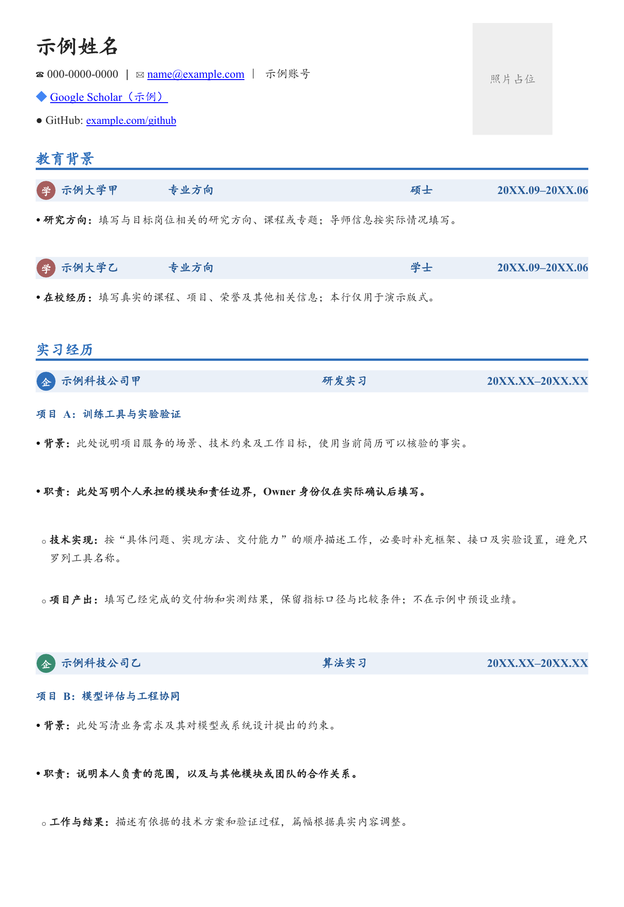
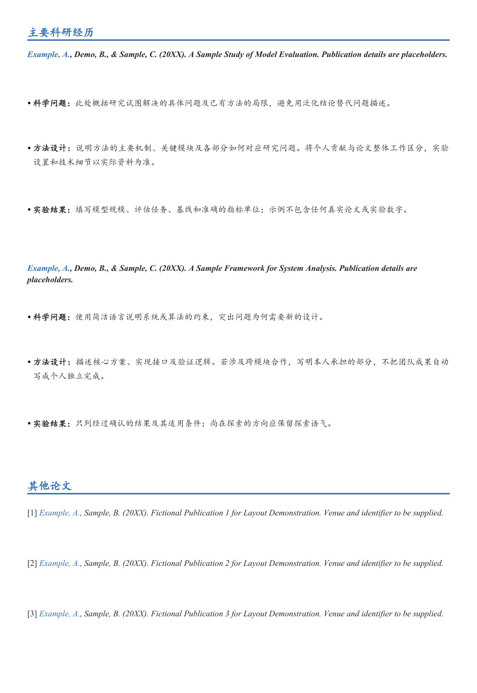

# GoddessReSUme

用于中文技术与科研简历的可复用 Codex skill，同时优化专业表达和 Word 格式排版。

## 能做什么

- **经历专业化**：组织业务背景、技术难点、个人职责和成果；根据已确认事实明确项目 Owner 的责任范围。
- **字体与字号对齐**：中文楷体，英文及数字 Times New Roman；姓名 20 pt、栏目 14 pt、机构抬头 11 pt、项目标题与正文 10.5 pt，落实到文字 run 并检查渲染时的字体替代。
- **逐段独立文本框**：每个标题、正文段落、项目符号条目和论文条目分别成框，可单独移动；机构抬头与图标、条带保持合理分组。
- **全宽栏目横线**：栏目标题下方配 2 pt 粗横线，横贯正文版心并与机构条带左右对齐，随标题文本框移动。
- **从经历图标取色**：选择一段经历的图标作为全篇主题来源，派生标题深色与条带浅色。
- **查找并嵌入图标**：即使只有经历文字，也为实际学校、任职机构和联系平台搜索官方图标、下载验证后嵌入；不将个人项目误当任职机构。
- **原生组件构建**：附带 Word 构建模块，复用字体、逐段文本框、原生两级编号、整条机构抬头和链接，减少每次从头实现的偏差。
- **局部精修与补漏**：尊重最新手工修改，支持恢复缺失内容、补充图标、调整联系方式，并核对文字与版面。

只改一句话时直接提供文案；整份 Word 简历润色、完整优化或生成时，同时执行字体写入、逐段拆框与内容检查。用户明确要求保留格式或只改局部时遵守其范围。专业化表达以已有事实为依据，不编造职责、指标或成果。

## 安装

将仓库克隆到 Codex 的个人 skills 目录。默认位置如下；如果已设置 `CODEX_HOME`，请使用对应目录。

```sh
git clone https://github.com/Dylanwga/GoddessReSUme.git ~/.codex/skills/goddessresume
```

已有同名目录时先检查内容，避免覆盖本地修改。展示名称为 **GoddessReSUme**；内部标识遵循 skill 的小写命名规范，安装后在新会话中使用 `$goddessresume`。

## 使用示例

```text
使用 $goddessresume 优化这份简历：专业化改写实习和科研经历，
保留事实与指标，按内置版式统一排版，并从最新实习经历的图标选择主题色。
```

```text
使用 $goddessresume，只修改指定经历，明确我作为项目 Owner 的职责，
保留其他部分的内容与位置。
```

```text
使用 $goddessresume，在 GitHub 链接前补一个图标，保持原链接和其他排版。
```

请提供完整 skill 文件夹，包含 `assets`、`references` 和 `scripts`。完整生成依次处理实际内容与缺失字段、图标获取与取色、组件构建与分页、结构与逐页渲染；缺少主页或照片时默认省略，不把示例占位文字带入成稿。

Word 文件处理需要可用的 DOCX 编辑、字体和渲染能力；若环境提供 documents 技能，可配合使用。构建模块依赖 `python-docx` 和 `lxml`，用法见 [组件构建](references/construction.md)。它不自动测量文本或分页，仍须按内容调整高度并渲染。清点脚本仅依赖 Python 标准库，可检查 OOXML 文本、对象与链接；它不验证字体，也不能替代视觉检查。

## 版式预览

当前预览：**全宽栏目粗横线版**。点击图片可查看大图。

以下样例从空白文档重建，身份、机构、经历、论文及日期均为虚构，照片为原生占位框。蓝色仅演示图标取色规则；实际简历按选定经历的图标配色。

| 第 1 页 | 第 2 页 |
| --- | --- |
|  |  |

[下载可编辑的脱敏 Word 样例](assets/layout-reference.docx)

## 文件说明

| 文件 | 用途 |
| --- | --- |
| [SKILL.md](SKILL.md) | 工作范围、事实边界与内容/版式验收要求 |
| [references/writing.md](references/writing.md) | 专业化表达与职责、成果的写法 |
| [references/layout.md](references/layout.md) | 字体、配色、尺寸、间距和对齐规范 |
| [references/word-editing.md](references/word-editing.md) | Word 编辑、补漏与渲染检查 |
| [references/icons.md](references/icons.md) | 图标的官方搜索、下载、验证、嵌入与缺失处理 |
| [references/construction.md](references/construction.md) | 从内容到原生 Word 组件的构建与分页流程 |
| [scripts/docx_components.py](scripts/docx_components.py) | 独立文本框、机构条带、编号和图标链接构建模块 |
| [scripts/docx_inventory.py](scripts/docx_inventory.py) | 只读 DOCX 内容与对象清点工具 |
| [agents/openai.yaml](agents/openai.yaml) | Codex 展示名称和默认调用提示 |

```sh
python scripts/docx_inventory.py /path/to/resume.docx
python scripts/docx_inventory.py /path/to/before.docx --compare /path/to/after.docx
```
