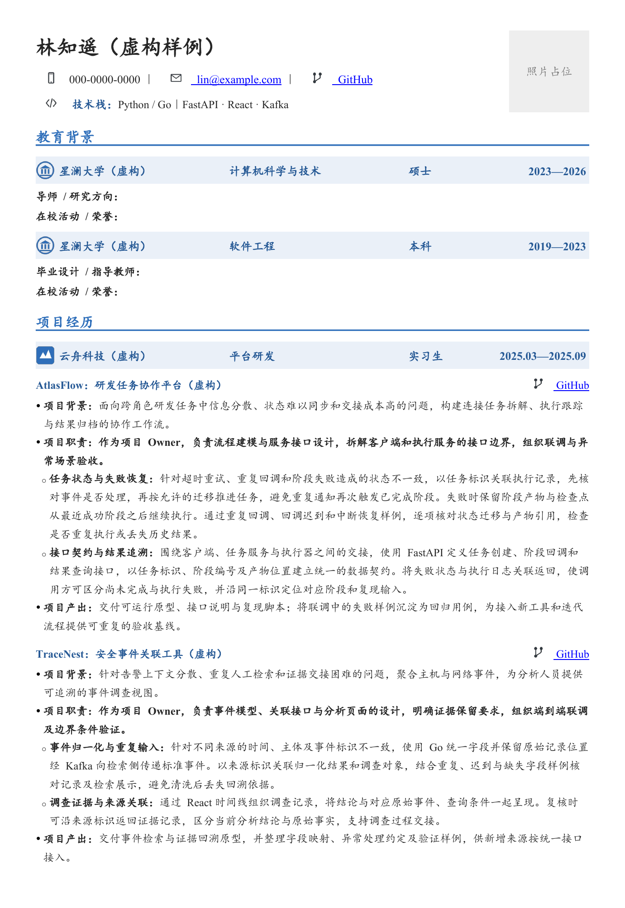

# GoddessReSUme

中文技术与科研简历 skill：组织真实经历，生成可逐段编辑的 Word，并独立验收内容、对象结构和页面效果。

## 工作方式

**第一部分：流程。** 内容撰写梳理项目背景、真实 Owner 职责、技术工作与成果；排版格式获取图标、确定主题、构建原生对象，再按内容调整间距和分页。

**第二部分：验收。** 对照事实与同一份版式规范，分别检查文字、对象和全部渲染页面。保存成功不能代替视觉检查，用户在目标应用中发现的显示问题需要实际处理。

具体规则集中在 [版式规范](references/style-spec.md)：

- 中文楷体，西文及数字 Times New Roman；主题色来自选定经历的图标。
- 每个逻辑段落独立文本框；按渲染文字边缘收紧框高，同一项目内保持紧凑。
- 栏目标题与正文等宽粗横线组成局部原生组。
- 机构抬头由**底色矩形、独立图标和透明文字框**组成，文字垂直居中，各对象可分别编辑，整条可一起移动。
- 项目 GitHub 图标和链接与小标题同行、靠右；与页首个人 GitHub 分开处理。
- 每段教育默认保留学术信息和活动／荣誉两条介绍，缺资料时自动留可编辑空白。
- 背景、职责为实心一级分点，技术实施为空心二级分点；页首可添加技术栈。
- 重点技术分项展开问题、机制及有依据的验证或作用，按重要程度分配篇幅，不写成整齐划一的一句功能摘要。
- 完整新建默认充实一页，以实际正文页尾余量验收；内容深度独立检查，内容不足先完善有依据的表述，不靠拉间距填页。

已确认的 Owner 身份会明确写出。公开仓库的功能不等同于个人贡献；不新增未经支持的指标、工作、熟练度或落地结论。局部任务尊重最新文件及保留范围。

## 安装与使用

将完整仓库放入 Codex 的个人 skills 目录。默认安装位置：

```sh
git clone https://github.com/Dylanwga/GoddessReSUme.git ~/.codex/skills/goddessresume
```

若设置了 `CODEX_HOME`，使用对应目录；已有同名目录时先保留本地修改。展示名称是 **GoddessReSUme**，调用名为 `$goddessresume`。

```text
使用 $goddessresume，根据这些经历制作 Word 简历。
明确项目 Owner 的真实职责，保留独立项目背景；
采用内置字体、分层机构条带和逐段文本框，项目仓库放在小标题右侧。
```

```text
使用 $goddessresume，只调整这份最新简历的机构抬头，
将底色、文字和图标分开并垂直居中，保留其他内容和位置。
```

使用完整文件夹，包括 `references`、`scripts` 和 `assets`。构建器依赖 `python-docx` 与 `lxml`；样例重建另需 Pillow。结构清点和渲染文字测量仅需 Python 标准库；实际 bbox 由 Poppler 的 `pdftotext` 导出。字体和 DOCX 渲染器须在执行环境可用；若提供 documents 技能，可采用其渲染流程。构建器的高度估算不能替代渲染，也不会从仓库自动推断候选人的个人能力。

## 版式预览

样例从空白文档生成；身份、机构、经历、论文、日期和标识均为虚构，照片使用原生占位框。图标仅演示位置和分层，正式简历应取得对应机构及平台的真实图标。单页示例展示默认教育填写位、两级分点和不同深度的技术段落；正文采用已验证的左对齐兼容设置，避免当前预览转换器在两端对齐时漏绘行尾标点。用户指定的多页或局部范围优先。

<!-- reference-previews:start -->

<!-- reference-previews:end -->

[查看可编辑的虚构样例](assets/layout-reference.docx)

## 文件分工

| 文件 | 职责 |
| --- | --- |
| [SKILL.md](SKILL.md) | 流程与验收入口、任务范围 |
| [内容流程](references/workflow-content.md) | 事实、责任边界、专业表达与内容单元 |
| [排版流程](references/workflow-layout.md) | 图标、组件、布局、分页与渲染 |
| [版式规范](references/style-spec.md) | 唯一的字体、颜色、对象和几何依据 |
| [验收规则](references/acceptance.md) | 内容、结构、视觉的通过条件与返修 |
| [组件接口](references/construction.md) | 原生组件 API 与能力边界 |
| [图标获取](references/icons.md) | 检索、下载、核验和嵌入 |
| [Word 精修](references/word-editing.md) | 保留最新编辑状态的局部操作 |
| [构建器](scripts/docx_components.py) | 从空白 Word 构建文字框与局部组 |
| [渲染测量](scripts/layout_metrics.py) | 结合文字框清单检查实际行数、文字间距与页尾密度 |
| [清点工具](scripts/docx_inventory.py) | 只读检查文字、关系、对象及组内结构 |
| [样例构建](scripts/build_reference.py) | 用虚构资料从空白重建参考 Word |

```sh
python scripts/docx_inventory.py resume.docx
python scripts/docx_inventory.py before.docx --compare after.docx
```

修改组件或默认版式时，同时重建虚构样例、重新渲染预览并检查全部页面。用户原件、截图、正式输出和私人 QA 材料不进入仓库。
